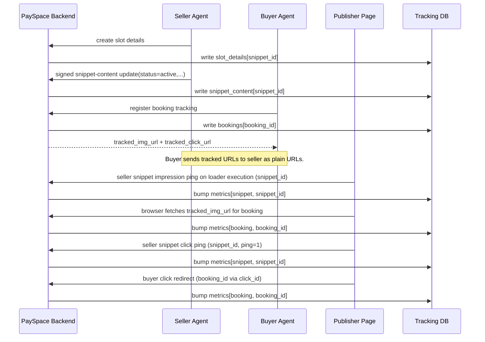
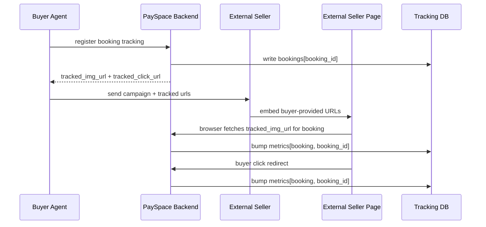
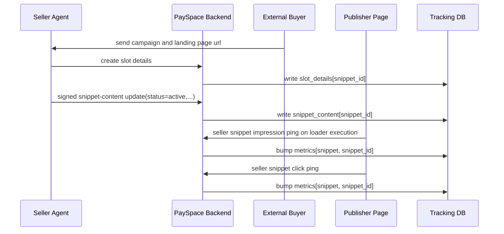

# Tracking Process

This document explains the current PaySpace backend tracking model in
[`src/routes/tracking.ts`](./src/routes/tracking.ts).

## Core Idea

`snippet_id` and `booking_id` are intentionally distinct.

- `snippet_id`
  Seller-side lifetime slot metrics.
  This starts counting from the moment the snippet is live and keeps increasing.

- `booking_id`
  Buyer-side campaign metrics.
  This starts counting only when a buyer opts into tracking for that campaign.

They do **not** need to be linked in backend state for tracking to work.

They do, however, share the same storage shape.

The backend now keeps one `metrics` collection/table with rows like:

```json
{
  "metric_type": "snippet",
  "metric_id": "snip_pub_123_0",
  "impressions": 160,
  "clicks": 12,
  "geo": { "NG": 40, "US": 20 },
  "updated_at": "2026-03-23T12:00:00.000Z"
}
```

and:

```json
{
  "metric_type": "booking",
  "metric_id": "book_abc123",
  "impressions": 60,
  "clicks": 5,
  "geo": { "NG": 20, "US": 10 },
  "updated_at": "2026-03-23T12:00:00.000Z"
}
```

So the schema is shared, while the values remain intentionally different.

`booking_id` is generated by the backend and returned to the buyer-side caller.
The caller does not supply the authoritative booking id.

The connection is the rendered ad itself:

```html
<div id="snippet_id">
  <a href="tracked_click_url_for_booking">
    
  </a>
</div>
```

The snippet loader then:

- tracks seller-side snippet impressions and clicks using `snippet_id`
- renders buyer-tracked URLs directly when a booking is active

## Route Model

### Seller-side snippet tracking

Seller-side snippet handling is now split in two parts:

- `POST /tracking/slot-details`
  Creates stable slot details:
  - `snippet_id`
  - `owner_pubkey`
  - element id
  - default layout constraints

- `POST /tracking/snippet-content`
  Updates the current renderable snippet content:
  - `inactive|active` status
  - tracked image URL
  - tracked click URL
  - optional placeholder markup
  - signature + monotonic version/nonce

The backend stores:

- stable slot details in `slot_details`
- current signed content in `snippet_content`

The action URL can be:

- a buyer tracked click URL from another platform
- a PaySpace tracked click URL
- a plain landing page URL

So the snippet loader does not need to understand any booking model to render.

### Buyer-side booking tracking

The buyer registers campaign tracking via `POST /tracking/bookings/register`.

The backend stores:

- `booking_id`
- tracked image URL
- tracked click URL

The seller does not need to know the raw `booking_id` to embed tracking.
It only needs the tracked URLs.

## Route Walkthrough

### `GET /tracking/image`

The impression endpoint:

1. resolves explicit ids from query params
2. writes one event
3. increments whichever scopes are present:
   - snippet metrics by `snippet_id`
   - booking metrics by `booking_id`
4. updates geo impression counts
5. returns:
   - the real booking image when `booking_id` is present
   - otherwise a transparent pixel

### `GET /tracking/click`

The click endpoint:

1. resolves explicit ids from query params
2. writes one click event
3. increments whichever scopes are present
4. either:
   - redirects to the destination URL
   - or returns `204` when called with `ping=1`

The snippet loader uses `ping=1` for seller-side snippet click counting so the
anchor href can still be the buyer's redirect URL.

### `POST /tracking/slot-details`

This creates stable slot details:

1. accept or create `snippet_id`
2. require the snippet owner pubkey
3. store element id and size constraints
4. seed an initial inactive content record
5. return a copy-paste script embed block

### `POST /tracking/snippet-content`

This updates current snippet content:

1. accept a signed content payload
2. hash the canonical payload
3. verify the signature against stored `owner_pubkey`
4. enforce increasing `version`
5. persist the new renderable state

### `POST /tracking/bookings/register`

This is buyer-side registration:

1. generate `booking_id`
2. generate `tracked_img_url` and `tracked_click_url`
3. store the buyer-side campaign tracking record

## Snippet Format

The current loader is intentionally similar in spirit to ad-network embeds like
Google AdSense:

```html
<div id="snippet_id"></div>
<script async src="https://backend.example/tracking/snippet/loader.js?id=snippet_id"></script>
```

The loader JS:

1. finds the target container div
2. always keeps the snippet shell present
3. if content is `active`, injects the ad anchor and image
4. if content is `inactive`, keeps a minimal shell present
5. immediately fires seller-side snippet impression tracking on load
6. if active, the rendered image itself is already a buyer-tracked image URL
7. on click, pings seller-side snippet click tracking
8. lets the anchor href handle buyer-side tracked click redirect or plain navigation

That means the rendered click path can look like:

```html
<div id="snippet_id">
  <a href="tracked_click_url">
    
  </a>
</div>
```

while the loader still records seller-side snippet click metrics in the
background.

## Signed Snippet Content Payload

The seller agent signs the canonical hash of the snippet content payload fields:

```json
{
  "snippet_id": "hero-banner-top",
  "version": 3,
  "status": "active",
  "image_url": "https://payspace.example/tracking/image?booking_id=book_123",
  "action_url": "https://buyer.example/redirect/book_123",
  "write_up": "Campaign headline"
}
```

The backend:

1. loads `slot_details.snippet_id`
2. reads `slot_details.agent_pubkey`
3. recomputes the canonical hash of the payload
4. verifies that the provided signature matches that hash
5. stores the resulting `snippet_content`

## Internal Seller + Internal Buyer



## Internal Buyer + External Seller



There may be no PaySpace `snippet_id` in this mode at all.

## External Buyer + Internal Seller



There may be no PaySpace `booking_id` in this mode at all.

## Why This Matches A Decentralized Setting

This model does not require:

- both agents to be on the same platform
- seller to understand buyer-private ids
- buyer to understand seller-private ids
- backend linkage between `snippet_id` and `booking_id`

Instead, the cross-platform contract is:

- the buyer can send tracking URLs
- the seller can choose to embed them
- the seller can still keep its own snippet metrics independently

## Practical Consequence

The two counters can be different and that is okay.

Example:

- snippet had 100 impressions before any campaign booking
- buyer campaign starts
- campaign gets 60 more impressions

Then:

- `snippet_id.impressions = 160`
- `booking_id.impressions = 60`

That is expected and desirable:

- seller sees lifetime slot performance
- buyer sees campaign-only performance

## Snippet Lifecycle

### Before booking

The snippet is a tracked seller-side container with `inactive` content.

Typical state:

- `snippet_id` exists
- slot details exist
- `snippet_content.status = "inactive"`
- no buyer tracking URLs are attached yet
- seller-side snippet impressions can still increase whenever the loader runs
- the snippet may render:
  - optional placeholder content
  - a collapsed shell
  - house ads

In this phase the important row is:

```json
{
  "metric_type": "snippet",
  "metric_id": "snip_pub_123_0",
  "impressions": 100,
  "clicks": 3
}
```

There may be no booking row yet.

### During booking

Once a buyer campaign is accepted:

1. the buyer registers booking tracking and gets:
   - tracked image URL
   - tracked click URL
2. the seller sends a signed snippet-content update with:
   - `status = "active"`
   - tracked image URL
   - tracked click URL
   - optional layout overrides
3. the snippet loader now fires two kinds of tracking once the slot is visible:
   - seller-side snippet metrics
   - buyer-side booking metrics

From that point:

- snippet metrics continue lifetime accumulation
- booking metrics start from zero for this campaign

Example:

- before booking: snippet impressions = 100
- during booking: campaign gains 60 impressions

Then:

- `metrics(snippet, snippet_id).impressions = 160`
- `metrics(booking, booking_id).impressions = 60`

### In-between process

The transition from "plain snippet" to "active booked snippet" is:

1. publisher or seller creates the snippet shell
2. snippet id becomes available for seller-side analytics
3. buyer decides to opt into campaign tracking
4. buyer sends URLs, not internal ids, to the seller
5. seller updates the signed snippet content to use those URLs
6. the loader begins dual firing:
   - seller snippet tracking through the loader
   - buyer tracking through the tracked image and click URLs

That means the cross-platform contract stays simple:

- sellers embed URLs
- buyers own booking tracking privately
- the snippet remains seller-owned regardless of which platform the buyer uses
